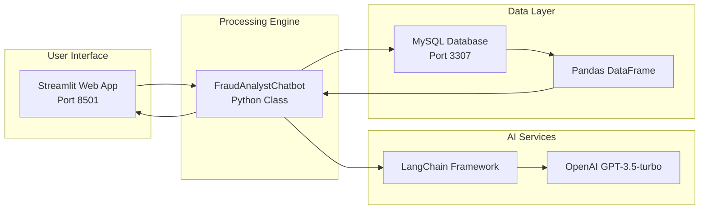

https://github.com/user-attachments/assets/57232af3-cb86-4d8a-ab8a-1954fcf1c116

# AI Chatbot Query Processing Flow

## Flow Diagram

```mermaid
flowchart TD
    A[User Types Query in Streamlit:<br/>"give me top 10 fraudulent transactions"] --> B[Streamlit Web Interface<br/>rag_chatbot.py<br/>Port: 8501]
    
    B --> C[User clicks "🔍 Analyze" button]
    C --> D[FraudAnalystChatbot.process_query method]
    
    D --> E[Step 1: Natural Language to SQL<br/>natural_language_to_sql method]
    E --> F[LangChain LLMChain with Prompt Template]
    F --> G[OpenAI GPT-3.5-turbo<br/>Temperature: 0.1]
    G --> H[SQL Generation with Database Schema Context]
    H --> I[Generated SQL Query:<br/>SELECT trans_num, probability<br/>FROM fraud_predictions<br/>WHERE is_fraud = 1<br/>ORDER BY probability DESC<br/>LIMIT 10]
    
    I --> J[Step 2: Database Query Execution<br/>execute_sql_query method]
    J --> K[MySQL Connector Connection]
    K --> L[MySQL Database<br/>Container: mysql<br/>Port: 3307<br/>Database: kafka_data]
    L --> M[fraud_predictions Table]
    M --> N[Query Results as Pandas DataFrame]
    
    N --> O[Step 3: AI Analysis & Explanation<br/>generate_fraud_explanation method]
    O --> P[LangChain LLMChain with Results]
    P --> Q[OpenAI GPT-3.5-turbo<br/>Temperature: 0.1]
    Q --> R[Intelligent Fraud Analysis]
    R --> S[AI-Generated Explanation:<br/>- Key Findings<br/>- Risk Patterns<br/>- Statistical Insights<br/>- Recommendations]
    
    S --> T[Streamlit Display Components]
    T --> U[📊 Results Section:<br/>- Generated SQL Query (expandable)<br/>- AI Analysis Text<br/>- Data Table with Results<br/>- Download CSV Button]
    
    U --> V[User Sees Complete Answer:<br/>SQL + Analysis + Data]
```

## Service Responsibilities

### **Streamlit Web Interface** (`rag_chatbot.py`)
- **Port**: 8501
- **Responsibilities**:
  - User query input and processing
  - Results visualization and display
  - Interactive data tables
  - File download functionality
  - Real-time status updates

### **FraudAnalystChatbot Class**
- **Core Processing Engine**
- **Responsibilities**:
  - Query orchestration and coordination
  - LLM setup and management
  - Database operations and data retrieval
  - Error handling and fallbacks
  - Result formatting for display

### **AI Processing Services**
- **LangChain Framework**: Prompt management and LLM orchestration
- **OpenAI GPT-3.5-turbo**: Natural language understanding and SQL generation

### **Data Services**
- **MySQL Database**: Data storage and query execution
- **Pandas DataFrame**: Data processing and table formatting

## User Experience Flow

1. **User opens Streamlit app** (http://localhost:8501)
2. **User enters query** in text input field
3. **User clicks "�� Analyze"** button
4. **Streamlit shows loading spinner** during processing
5. **Results appear in right column**:
   - Generated SQL (expandable section)
   - AI Analysis (intelligent explanation)
   - Data Table (query results)
   - Download button (CSV export)
6. **User can interact** with results (expand/collapse, download)

## Key Components

### **Main Interface Layout**
```python
col1, col2 = st.columns([1, 1])

# Left Column: Query Input
with col1:
    user_query = st.text_input("Enter your fraud analysis question:")
    if st.button("🔍 Analyze", type="primary"):
        # Process query

# Right Column: Results Display
with col2:
    # Show SQL query (expandable)
    with st.expander("🔍 Generated SQL Query"):
        st.code(result["sql_query"], language="sql")
    
    # Show AI analysis
    st.subheader("📈 Analysis")
    st.write(result["explanation"])
    
    # Show data table
    st.subheader("�� Data")
    st.dataframe(result["results"])
    
    # Download button
    st.download_button("�� Download Results", csv_data)
```

## Data Flow Architecture



## Quick Start

1. **Start the system**:
   ```bash
   docker-compose up -d
   ```

2. **Access Streamlit app**:
   ```
   http://localhost:8501
   ```

3. **Enter your query**:
   ```
   "give me top 10 fraudulent transactions"
   ```

4. **View results** with SQL, analysis, and data table

---

**The system provides enterprise-grade fraud detection capabilities with intelligent natural language querying, making it accessible to both technical and non-technical users.**

### (*Recommended*) Please go through the Project_Report.pdf file for detailed description of the project.(ChatBot functionality not included there; please refer above details to understand ChatBot workflow.)

# Real-Time-Fraud-Detection-System

Phase 1 (Testing basic connections: completed)

Consistes of :
1-Testing Real time transactions data is getting produced using kafka producer.
2-Testing that the transactions data sent is getting consumed successfully by kafka consumer.
3-Before getting consumed, made a Risk Profile for the users in a table in MySQL.
4-Storing the consumed raw transactions in a table in MySQL successfully.

Phase 2 - Full working project

Phase 3 - Adding ChatBot

Feel free to email me for any feedback/doubts :)

Thank you!
